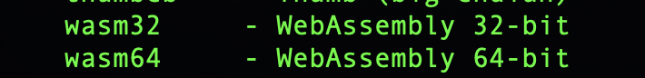
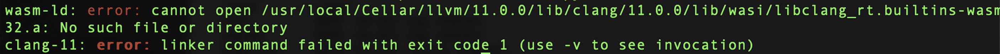

# Universal ECDSA C/C++

This section uses the C/C++ language with the LLVM tool chain to generates portable [Web Assembly](https://webassembly.org/) (WASM) file that generates digital signatures `(r,s)` for the secp256k1 curve.

The binaries are consumed by the JS engine at run time and are converted into a `private/ecdsa.json` file.

## About

## MacOS setup homebrew

Clone repo.
```shell
git clone https://github.com/relocke/wasm-secp256k1.git
```

Install LLVM.

```shell
brew install llvm
```

Activate instillation.

```shell
export PATH=/usr/local/opt/llvm/bin:$PATH
```

Check you have wasm32.

```shell
llc --version
```



Install Web Assembly Binary Toolkit [WABT](https://github.com/WebAssembly/wabt)
```shell
brew install wabt
```

Install [wasm-snip](https://github.com/rustwasm/wasm-snip)

```shell
cargo install wasm-snip
```

### Troubleshooting



To resolve this issue, you need to add `libclang_rt.builtins.a` library to the llvm path specified by the error.
Add the library `wasi/libclang_rt.builtins.a` into the path specified by your compiler.


# Build

```shell
source wasm.sh
```

### Resources

These are some resources for understanding ECC.

0. https://en.wikipedia.org/wiki/Elliptic_curve_point_multiplication
1. https://cryptobook.nakov.com/digital-signatures/ecdsa-sign-verify-messages
2. https://cryptobook.nakov.com/digital-signatures/ecdsa-sign-verify-examples
3. https://cryptobook.nakov.com/asymmetric-key-ciphers/elliptic-curve-cryptography-ecc
4. https://github.com/983/bigint
5. https://datatracker.ietf.org/doc/html/rfc6979#section-3.2
6. http://royalforkblog.github.io/2014/09/04/ecc/
7. https://github.com/B-Con/crypto-algorithms
8. https://github.com/bitcoin/bips/blob/master/bip-0062.mediawiki#Low_S_values_in_signatures
9. https://rosettacode.org/wiki/Category:C%2B%2B
10. https://hacks.mozilla.org/2019/03/standardizing-wasi-a-webassembly-system-interface/
11. https://en.bitcoin.it/wiki/Elliptic_Curve_Digital_Signature_Algorithm
12. https://github.com/fivepiece/sign-verify-message/blob/master/signverifymessage.md#encoding-of-a-recoverable-signature
13. https://www.secg.org/sec1-v2.pdf
14. https://bitcoin.stackexchange.com/questions/83035/how-to-determine-first-byte-recovery-id-for-signatures-message-signing